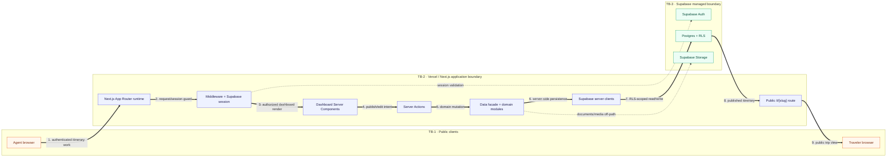

# TravelHub Runtime Architecture

High-level runtime view of the current repository. Solid arrows are intentionally limited to one primary path; supporting behavior is captured in cards below instead of adding more edges.

> **Artifact note:** the requested `archify` executable/skill is not installed in this runtime. This artifact uses a portable Mermaid diagram plus component cards, grounded in CodeGraph and repository evidence.

## Primary runtime path and trust boundaries

**Diagram scope:** 12 core components are shown. The solid chain is the primary authenticated publish/share flow; dotted relationships are only the two supporting security/storage relationships needed to interpret that path.

## Component cards

### Card · Public clients

- **Agent browser:** operates authenticated dashboard workflows under `/dashboard/**`.
- **Traveler browser:** consumes published itineraries at `/t/[slug]`; no dashboard account is required.
- **Evidence:** `src/app/dashboard/**`, `src/app/t/[slug]/page.tsx`.

### Card · Next.js App Router runtime

- One deployable application contains Server Components, Client Components, Server Actions, and route handlers.
- The repository does have HTTP route handlers for operational integrations; it does not have a separate API server.
- **Evidence:** `src/app/**`, `src/app/api/**`, `src/app/layout.tsx`.

### Card · Middleware + Supabase session

- `src/middleware.ts` protects `/dashboard/:path*`.
- Supabase mode requires a valid user and role; mock mode applies the same role model through the mock account fallback.
- **Evidence:** `src/middleware.ts:middleware`, `src/lib/supabase/middleware.ts`.

### Card · Dashboard UI and Server Actions

- Dashboard Server Components read aggregates and domain data; interactive controls use Client Components.
- Server Actions are the mutation boundary for trips, clients, suppliers, documents, settings, and related workflows.
- **Evidence:** `src/app/dashboard/page.tsx`, `src/app/dashboard/trips/new/actions.ts`, `src/app/dashboard/trips/[id]/actions.ts`.

### Card · Data facade and domain modules

- `src/lib/data.ts` is a compatibility facade; implementations live in bounded modules such as `trips.ts`, `clients.ts`, `documents.ts`, `suppliers.ts`, and `dashboard.ts`.
- The same modules support Supabase mode and in-memory mock mode.
- **Evidence:** `architecture.md`, `src/lib/data.ts`, `src/lib/data/shared.ts`.

### Card · Supabase server clients

- The SSR client carries cookie-backed user sessions.
- The service-role client is server-only and bypasses normal RLS; it must not cross into browser code.
- **Evidence:** `src/lib/supabase/server.ts:createClient`, `src/lib/supabase/server.ts:getSupabaseAdmin`.

### Card · Supabase Auth

- Authenticates dashboard users and supplies the session consumed by middleware/server code.
- The implementation supports `admin` and `agent` roles, not only a single admin account.
- **Evidence:** `src/lib/auth/roles.ts`, `src/middleware.ts`.

### Card · Postgres + RLS

- Stores clients, trips, trip days, items, documents metadata, services, WhatsApp/WCC data, and many-to-many `trip_clients` relationships.
- Public itinerary reads are constrained by published visibility policies; authenticated mutations are further protected by role/ownership checks.
- **Evidence:** `supabase/migrations/0001_init.sql`, `0003_rls_harden.sql`, `0006_trip_clients.sql`, `src/lib/data/trips.ts:getTripWithDetails`.

### Card · Supabase Storage

- Stores private trip documents and public media such as trip photos, covers, and site assets.
- Private documents use protected access/signed URLs; public media uses public buckets/URLs.
- **Evidence:** `src/lib/data/documents.ts`, `supabase/migrations/0002_storage_bucket.sql`.

### Card · Public itinerary route

- `/t/[slug]` loads the trip and related details, checks visibility, and renders the traveler-facing itinerary.
- It also supports draft preview and optional client-session behavior beyond the basic public path.
- **Evidence:** `src/app/t/[slug]/page.tsx:PublicTripPage`, `src/lib/data/trips.ts:getTripWithDetails`.

### Card · External integrations and automation

These are intentionally cards rather than extra graph edges:

| Dependency | Runtime role | Boundary / configuration |
|---|---|---|
| **Vercel** | Hosts the Next.js runtime and provides deployment/runtime metadata. | Platform boundary; deploys from `main`. |
| **Google Maps / Places** | Optional location autocomplete and map embeds. | Browser/server feature; enabled by `NEXT_PUBLIC_GOOGLE_MAPS_API_KEY`. |
| **Open-Meteo** | Optional daily weather enrichment on public itineraries. | Server fetch; graceful `null` fallback on failure. |
| **Aviationstack** | Optional flight-status lookup. | Server route; enabled by `FLIGHT_API_KEY`. |
| **Resend** | Optional trip-reminder email delivery. | Server-only `RESEND_API_KEY`; cron requires `CRON_SECRET` in production. |
| **Meta WhatsApp** | Webhook verification, inbound events, and outbound messages. | Provider signature/token boundary; `/api/whatsapp/webhook`. |
| **Configurable LLM provider** | Optional WhatsApp decisioning with JSON-constrained output. | Server-only API key/model/base URL; failures escalate to human handling. |
| **MCP clients** | Authenticated operational tooling over route handlers. | API-key/auth boundary; see `src/app/api/mcp/route.ts`. |
| **Vercel Analytics** | Client/runtime telemetry integration. | Loaded by `src/app/layout.tsx`. |

## Security and documentation cards

### Card · Trust-boundary rules

- Public browser input crosses into the Next.js server at route/action boundaries.
- `/dashboard/**` requires Supabase Auth plus role/feature checks.
- Public itinerary exposure is intentionally limited to published data; preview and client-session paths are separate cases.
- Service-role credentials remain server-only and are stronger than normal RLS enforcement.
- WhatsApp, cron, and MCP entry points require provider signatures, bearer secrets, or API keys.

### Card · Current documentation drift

- `architecture.md` says there is no API layer; the implementation has WhatsApp, MCP, cron, flight-status, and WCC route handlers. There is no separate API server, but there are HTTP endpoints.
- `architecture.md` describes one admin; the code supports `admin` and `agent` plus a separate client PIN portal.
- The documented `clients → trips` relationship is incomplete because `trip_clients` supports many-to-many assignment.
- The documented Storage summary omits public media buckets.
- The WhatsApp route currently contains a raw `console.error` payload path that does not match the documented sanitized-observability rule and should be treated as a follow-up security review item.

## Evidence index

- `project.md` — business surfaces and primary itinerary use case.
- `architecture.md` — intended stack and original high-level topology.
- `src/middleware.ts` — dashboard boundary and mock/Supabase auth behavior.
- `src/app/dashboard/trips/new/actions.ts` — trip creation mutation path.
- `src/app/t/[slug]/page.tsx` — public itinerary path.
- `src/lib/data/trips.ts` — trip aggregation and RLS-backed reads.
- `src/lib/supabase/server.ts` — SSR and service-role client construction.
- `src/app/api/whatsapp/webhook/route.ts` — external webhook entry point.
- `src/app/api/cron/trip-reminders/route.ts` — protected automation entry point.
- `supabase/migrations/0001_init.sql`, `0002_storage_bucket.sql`, `0003_rls_harden.sql`, `0006_trip_clients.sql` — persistence, Storage, and policy evidence.
