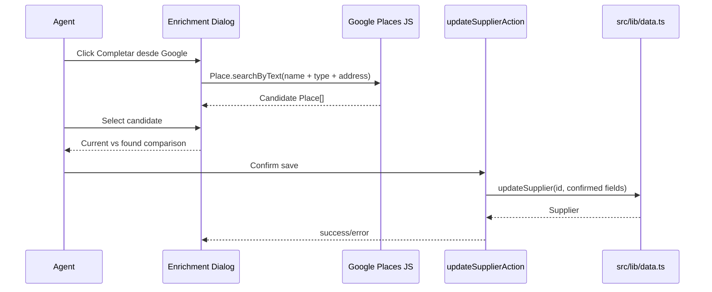

# Design: Supplier Place Enrichment (issue #172)

## Technical Approach

Add an enrichment dialog launched from each supplier row. The dialog is a focused Client Component because it needs browser Google Maps JS APIs, local candidate state, and user confirmation. It reuses the current Server Action update path to preserve Supabase/mock dual-mode behavior.

## Flow

## Decisions

- Use `Place.searchByText` instead of autocomplete for enrichment because the query can be built from existing supplier data and can return a reviewable candidate list.
- Keep persistence through `updateSupplierAction`; no new API route or direct data access from components.
- Only include confirmed fields (`address`, `lat`, `lng`, `googlePlaceId`) in the form payload while preserving existing required fields and optional supplier fields.
- Missing key, script load failure, and no-result states are UI-only and do not block manual editing.

## Data and Security

- Uses the existing public browser Google key, consistent with the prior Places autocomplete feature.
- Does not expose Supabase service role keys; supplier update remains server-side.
- No schema migration is needed because `google_place_id`, `address`, `lat`, and `lng` already exist.

## Test Strategy

- Component/server-render tests cover comparison UI and missing-key state.
- Data-layer regression test covers partial update preserving existing fields while applying Google metadata.
- Full verification runs unit tests plus production build.
